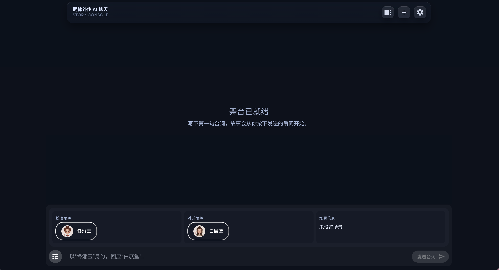

# 武林外传 AI 对话

基于 FastAPI 后端与 React 前端的角色扮演 AI 聊天应用。


## 功能特点

- **角色扮演对话**：内置《武林外传》角色，支持多轮连续对话
- **流式输出**：AI 回复实时流式显示
- **TTS 语音**：支持按角色朗读消息
- **会话持久化**：会话列表与历史保存，支持多会话切换
- **用户认证**：登录/注册，会话与用户关联
- **明暗主题**：明亮 / 暗黑模式切换
- **响应式设计**：适配桌面与移动端

## 快速开始

### 后端

```bash
cd backend
uv sync
cp .env.example .env
# 编辑 .env 配置数据库、LLM、TTS 等（详见 backend/README.md）
uv run main.py
```

服务默认运行在 `http://localhost:8081` 。

### 前端

```bash
cd frontend
npm install
npm start
```

应用默认运行在 `http://localhost:3000`。需配置 `REACT_APP_API_URL` 指向后端（详见 [frontend/README.md](frontend/README.md)）。

---

更多说明见 [backend/README.md](backend/README.md) 与 [frontend/README.md](frontend/README.md)。  

## DISCLAIMER
本项目使用《武林外传》相关元素，仅用于技术演示与学习交流，详见 [免责声明](DISCLAIMER.md)。