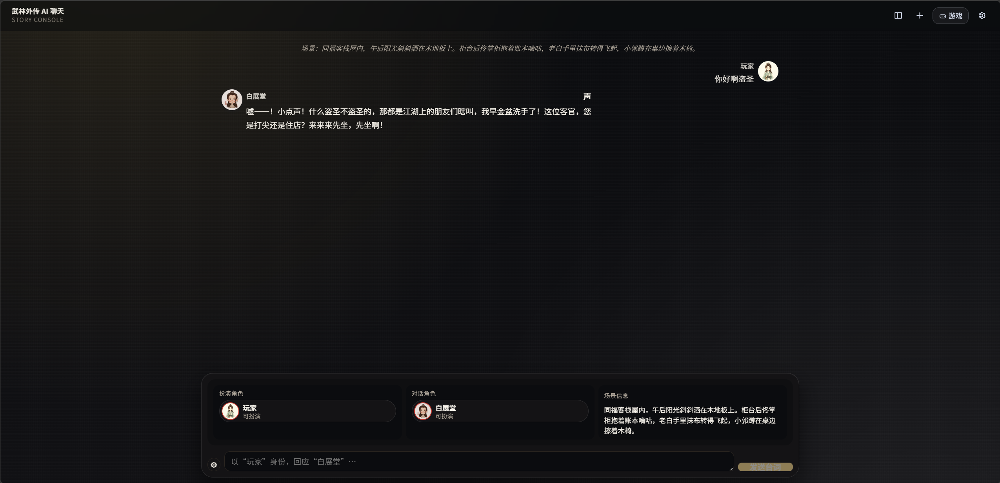

# 武林外传 AI 对话

基于 FastAPI 与 Vite/React 的《武林外传》角色扮演 AI 应用。


## 功能

- **角色扮演**：内置同福角色，可切换扮演身份与对话对象
- **文本对话**：多轮对话、会话列表与历史
- **2D 舞台**：同福客栈像素场景，移动与点选交互、叙事呈现
- **语音朗读**：消息 TTS
- **账号**：注册 / 登录，会话归属用户
- **主题**：明亮 / 暗黑，适配桌面与移动端

## 仓库结构

```
webui_2/
├── backend/      # FastAPI 服务
├── frontend/     # Vite + React 前端
├── openapi.json  # API 契约导出
└── dev-infra/    # 本地依赖（可选）
```

## 快速开始

**后端**（默认 `http://localhost:8081`，文档 `/docs`）：

```bash
cd backend
uv sync
cp .env.example .env   # 配置数据库、LLM、TTS 等
make dev
```

**前端**（默认 `http://localhost:5173`）：

```bash
cd frontend
pnpm install
cp .env.example .env   # 按需改 VITE_API_BASE_URL
pnpm dev
```

| 文档 | 说明 |
|------|------|
| [frontend/README.md](frontend/README.md) | 前端使用与目录 |
| [frontend/DEVELOPERS.md](frontend/DEVELOPERS.md) | 前端架构与开发规范 |
| [backend/README.md](backend/README.md) | 后端使用与 API 概览 |
| [backend/DEVELOPERS.md](backend/DEVELOPERS.md) | 后端架构与开发规范 |

## DISCLAIMER

本项目使用《武林外传》相关元素，仅用于技术演示与学习交流，详见 [免责声明](DISCLAIMER.md)。
